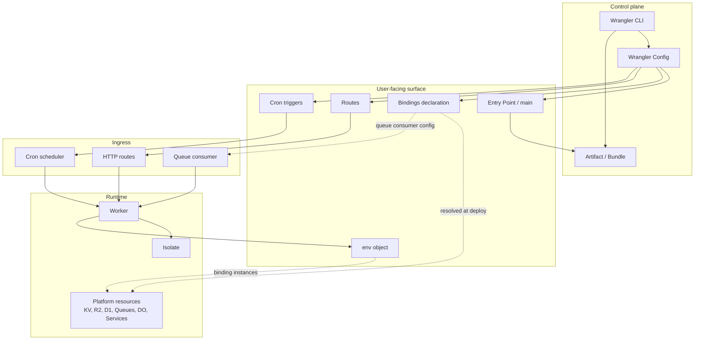

# Cloudflare platform domain map (research)

This is a conceptual map of the Cloudflare Workers domain: the *things* that exist and how they relate.

Source context: [Cloudflare Workers Bindings](https://developers.cloudflare.com/workers/runtime-apis/bindings/), [Wrangler configuration](https://developers.cloudflare.com/workers/wrangler/configuration/)

## Notes

- The user mostly thinks in: **Worker**, **bindings** (what resources I have), **routes** (how traffic reaches me), and **cron** (when I run on schedule).
- The control plane (Wrangler) produces **artifacts** and **metadata** from config; the platform provisions resources and wires bindings.
- At runtime, the Worker receives **env** with concrete resource APIs; ingress (HTTP, cron, queue) triggers execution.

## Open questions / assumptions

- **Assumption**: The diagram reflects the “happy path” for HTTP + cron + queue ingress; other triggers exist and can be added later.
- **Open question**: How does Cloudflare represent and expose “resource binding resolution” across local dev, preview, and production?

