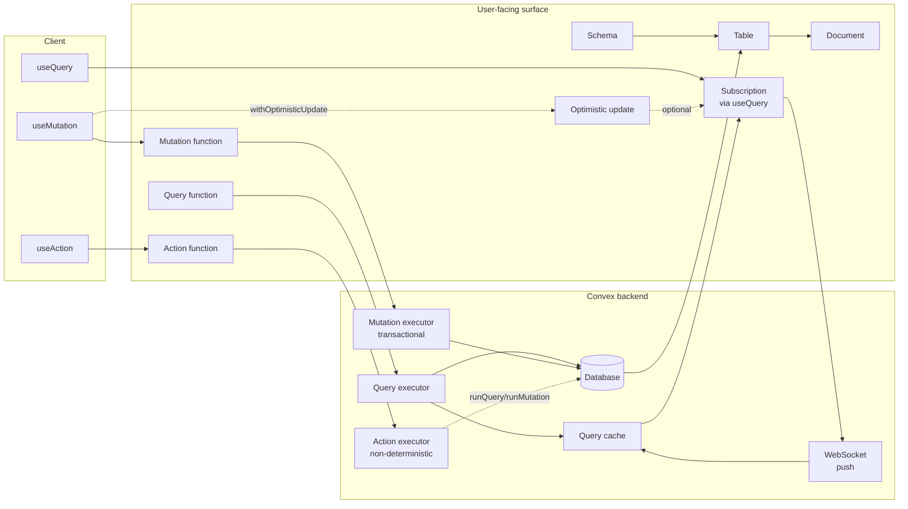

# Convex domain map (research)

This is a conceptual map of the Convex domain: the *things* that exist and how they relate.

Source context: [Convex Developer Hub](https://docs.convex.dev)

## Notes

- The user primarily thinks in: **tables**, **queries**, **mutations**, and **actions**.
- The backend makes this work by:
  - **caching** query results and pushing updates when data changes
  - **transactions** for mutations (all-or-nothing, consistent reads)
  - **WebSocket** for reactive delivery of new query results
- Optimistic updates are a client-side overlay, not a backend primitive.

## Open questions / assumptions

- Assumption: Convex’s caching + push model is the primary “reactivity engine”; details of delta delivery vs full-result push are not fully specified here.

