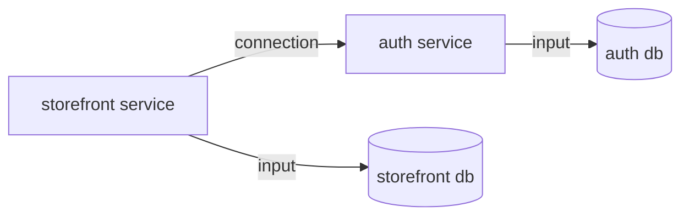
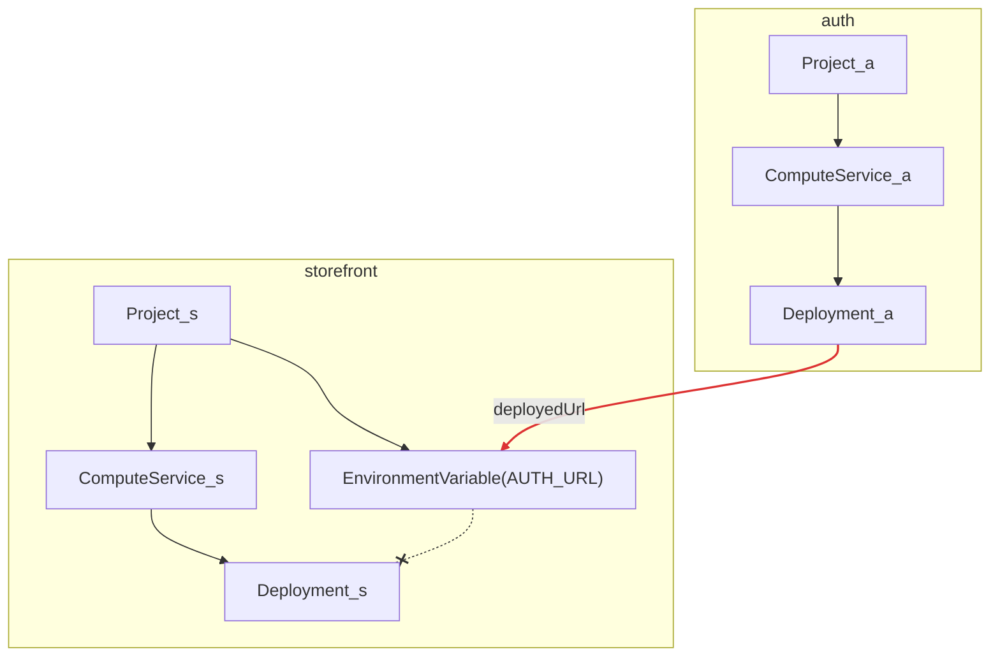
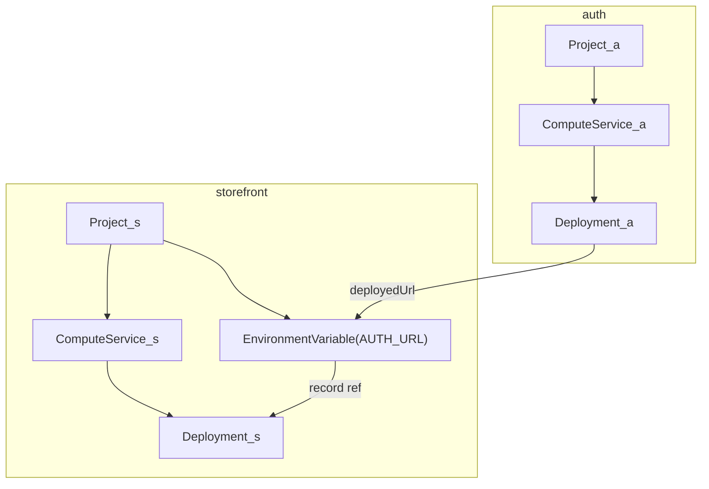

# Alchemy ↔ PDP — the resources we define and how they map

The Alchemy resource types `packages/prisma-alchemy` defines over the
[PDP data model](pdp-data-model.md), the mapping in both directions, and the
lowering graphs — including the correction that makes deploy ordering a property
of the dependency graph rather than luck.

## The resource inventory

Each row is an Alchemy resource type we define (Alchemy has no built-in types —
it manages whatever a provider package registers).

| Our resource | PDP entity it manages | Props (in) | Outputs (out) | Notes |
| --- | --- | --- | --- | --- |
| `Project` | Project | workspaceId, name | id | a default Database (and its `DATABASE_URL` templates) comes with it |
| `Database` | Database | projectId, name, isDefault | id, connection info | branch-scoped in PDP; we touch only the production branch's |
| `Connection` | database connection info | databaseId | url | direct/pooled endpoints |
| `ComputeService` | App | projectId, name, region | id | PDP attaches it to the production branch implicitly |
| `EnvironmentVariable` | ConfigVariable | projectId, class, key, value, branchId? | id | we write production-class templates only |
| `Deployment` | Deployment (ComputeVersion) + Promotion | computeServiceId, artifactPath, artifactHash, port, **environment (corrected — see below)** | versionId, deployedUrl | provider reconcile: create version → upload tar.gz → start → poll until running → promote; `deployedUrl` read **post-promote** (create-time domain is a placeholder — PRO-200) |

What we deliberately do **not** model yet, and where it will bite: **Branch**
(everything implicitly targets the production branch; the platform's
preview-class + branch-override structure is unmodeled — future
environments/stages work), **Promotion** as a standalone resource (the
Deployment provider auto-promotes; rollback is unexpressed), and non-default
**Databases** with contracts.

## The mapping, both directions

- **Ours → PDP**: each resource's provider (`reconcile`/`delete`) calls the
  Management API; the table above is that mapping. One resource maps to one PDP
  entity except `Deployment`, which spans version-create + upload + start +
  promote (and therefore owns the env-snapshot moment).
- **PDP → ours**: `foundryVersionId`, `Promotion`, Foundry's version record, and
  Branch have no resource of ours; they are internal to the `Deployment`
  provider's behavior or unmodeled. `serviceEndpointDomain` surfaces only as
  `Deployment.deployedUrl`.

## The lowering graphs

Three graphs tell the whole story. Arrows read "depends on / consumes a value
from"; Alchemy executes in dependency order and **runs unordered resources
concurrently — declaration order is never consulted**.

**1. MakerKit's graph** (semantic; what the user means):

**2. The Alchemy graph as first lowered — the flawed decomposition:**

`Deployment_s` consumes the service id; `EnvironmentVariable` consumes the
project id and auth's URL; **nothing connects the two** (dashed red), so Alchemy
may create the storefront's version while the variable is still being written —
and per the [PDP timing model](pdp-data-model.md#the-config-lifecycle--what-is-resolved-when),
a version created before the row exists **never** sees it. That is the
PRO-211 race, precisely located.

**3. The corrected graph — the environment is an input of the Deployment:**

This is not a workaround; it is **the platform's own dataflow restored**: PDP's
version-create call literally *contains* the materialized env map, so the
environment is genuinely an input to a version. Our first decomposition drew
`EnvironmentVariable` as a sibling of `Deployment` and lost that edge; Alchemy
faithfully executed the wrong graph we handed it.

Concretely: `Deployment` gains an `environment` prop carrying references to the
`EnvironmentVariable` records the version is expected to boot with. Two effects,
both by ordinary dependency-graph mechanics:

1. **Ordering.** The variable write completes before version-create — the race
   is impossible, for every deploy, on every target that follows this shape.
2. **Propagation.** When a producer redeploys and its URL changes, the variable's
   record changes → `Deployment_s`'s props diff → Alchemy creates a new
   storefront version, which snapshots the new value. Under PDP's
   snapshot-per-version semantics this is the *only* correct propagation
   mechanism — the graph edge implements restart-on-config-change at our layer.

MakerKit's core constructs these edges when lowering a connection (the
`writeConfig` results thread into `deploy` through the service SPI); no pack
author and no app author ever hand-wires them.

## Related

- [`pdp-data-model.md`](pdp-data-model.md) — the platform model these resources manage.
- [`../10-domains/core-model.md`](../10-domains/core-model.md) — the SPI that
  drives this lowering (three execution paths, phased service SPI).
- [`../03-domain-model/glossary.md`](../03-domain-model/glossary.md) § compile
  target — the Alchemy substrate itself.
