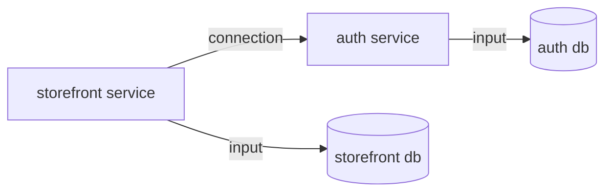
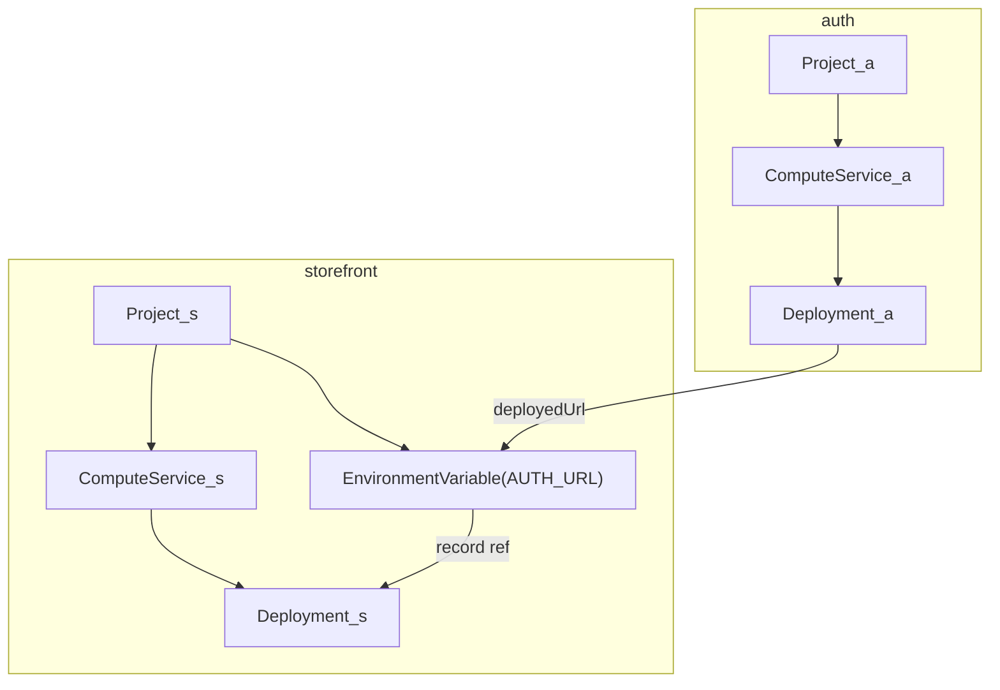

# Alchemy ↔ PDP — the resources we define and how they map

The Alchemy resource types `packages/prisma-alchemy` defines over the
[PDP data model](pdp-data-model.md), the mapping in both directions, and the
lowering graphs — including the correction that makes deploy ordering a property
of the dependency graph rather than luck.

## The resource inventory

Each row is an Alchemy resource type we define (Alchemy has no built-in types —
it manages whatever a provider package registers).

| Our resource | PDP entity it manages | Props (in) | Outputs (out) | Notes |
| --- | --- | --- | --- | --- |
| `Project` | Project | workspaceId, name | id | a default Database (and its `DATABASE_URL` templates) comes with it |
| `Database` | Database | projectId, name, isDefault | id, connection info | branch-scoped in PDP; we touch only the production branch's |
| `Connection` | database connection info | databaseId | url | direct/pooled endpoints |
| `ComputeService` | App | projectId, name, region | id | PDP attaches it to the production branch implicitly |
| `EnvironmentVariable` | ConfigVariable | projectId, class, key, value, branchId? | id | we write production-class templates only |
| `Deployment` | Deployment (ComputeVersion) + Promotion | computeServiceId, artifactPath, artifactHash, port, **environment** (the env-var records the version boots with — see the graphs below) | versionId, deployedUrl | provider reconcile: create version → upload tar.gz → start → poll until running → promote; `deployedUrl` read **post-promote** (create-time domain is a placeholder — PRO-200) |

What we deliberately do **not** model yet, and where it will bite: **Branch**
(everything implicitly targets the production branch; the platform's
preview-class + branch-override structure is unmodeled — future
environments/stages work), **Promotion** as a standalone resource (the
Deployment provider auto-promotes; rollback is unexpressed), and non-default
**Databases** with contracts.

## The mapping, both directions

- **Ours → PDP**: each resource's provider (`reconcile`/`delete`) calls the
  Management API; the table above is that mapping. One resource maps to one PDP
  entity except `Deployment`, which spans version-create + upload + start +
  promote (and therefore owns the env-snapshot moment).
- **PDP → ours**: `foundryVersionId`, `Promotion`, Foundry's version record, and
  Branch have no resource of ours; they are internal to the `Deployment`
  provider's behavior or unmodeled. `serviceEndpointDomain` surfaces only as
  `Deployment.deployedUrl`.

## The lowering graphs

Lowering turns MakerKit's semantic graph into an Alchemy resource graph. Arrows
read "depends on / consumes a value from"; Alchemy executes in dependency order
and **runs unordered resources concurrently — declaration order is never
consulted** — so every ordering MakerKit's semantics require must exist as an
edge.

**MakerKit's graph** (what the user means):

**The Alchemy graph it lowers to:**

How the pieces map:

- **Each service** lowers to its `Project → ComputeService → Deployment` chain
  (the resource inputs — here each service's database — ride the Project's
  default DB; see the inventory above).
- **The connection** lowers to two edges: the producer's `deployedUrl` flows
  into an `EnvironmentVariable` on the consumer's project, and that variable's
  **record reference flows into the consumer's `Deployment`** via its
  `environment` prop.

The `environment` prop is load-bearing and mirrors PDP's own dataflow — the
version-create call literally contains the materialized env map, so the
environment is genuinely an input to a version (see the
[config lifecycle](pdp-data-model.md#the-config-lifecycle--what-is-resolved-when)).
The edge does two jobs by ordinary dependency-graph mechanics:

1. **Ordering.** The variable write completes before version-create. Without
   this edge the two race — that failure mode is documented as PRO-211 in
   `gotchas.md`.
2. **Propagation.** When the producer redeploys and its URL changes, the
   variable's record changes → the consumer `Deployment`'s props diff → a new
   consumer version snapshots the new value. Under snapshot-per-version
   semantics this is the *only* correct propagation mechanism.

MakerKit's core constructs these edges when lowering a connection (the
`writeConfig` results thread into `deploy` through the service SPI); no pack
author and no app author ever hand-wires them.

## Related

- [`pdp-data-model.md`](pdp-data-model.md) — the platform model these resources manage.
- [`../10-domains/core-model.md`](../10-domains/core-model.md) — the SPI that
  drives this lowering (three execution paths, phased service SPI).
- [`../03-domain-model/glossary.md`](../03-domain-model/glossary.md) § compile
  target — the Alchemy substrate itself.
