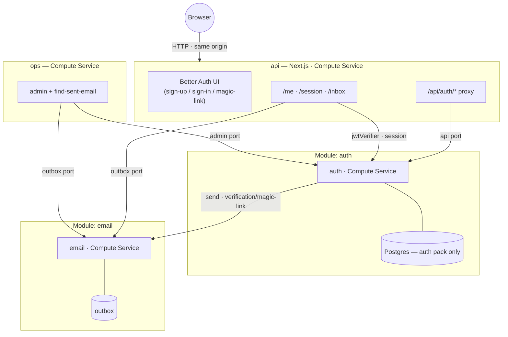

# auth — Better Auth, wired up

A readable example Prisma App: the shared **auth** module (Better Auth on a
dedicated Prisma Next Postgres) and the shared **email** module wired as its
delivery boundary, fronted by a **Next.js app** that renders a real
[Better Auth UI](https://better-auth-ui.com) and proxies auth to the module on
its own origin. Sign up, verify from a dev inbox, sign in, and see who you are —
locally, with no cloud credentials.



The browser only ever talks to the `api` origin: the Better Auth client is
`createAuthClient({ baseURL: <this app> })`, so every call hits
`<app>/api/auth/*` → the proxy → the auth service. Same-origin means first-party
httpOnly cookies and no CORS. The whole composition is [module.ts](module.ts).

## What each piece shows

- **[modules/api](modules/api)** — the browser front door, a Next.js app
  (`output: standalone`) run as a Composer compute service via
  `@prisma/composer/nextjs`. It renders the off-the-shelf Better Auth UI kit,
  mounts `authProxy` at `/api/auth/*`, and keeps the JSON demo surfaces as route
  handlers: `/me` (stateless JWT verify — no DB), `POST /session` (the session
  port's instant-logout lookup), `/health`. Its deps are **inferred** from
  `service.load()` — no hand-declared interface.
- **The dev inbox** ([modules/api/app/inbox](modules/api/app/inbox)) — local
  delivery is `none`, so verification / magic-link emails exist only in the
  email module's outbox and a browser has no inbox. This page reads the latest
  email for an address straight from the `outbox` port and renders its link as a
  clickable anchor — which doubles as visible proof of the module-to-module
  email wiring.
- **`auth` + `email` (shared modules)** — `auth()` owns a dedicated Prisma Next
  Postgres carrying only the auth pack; it depends on `email()` for
  verification / reset / magic-link delivery. `requireEmailVerification` is on,
  so the real verified flow is what the demo proves.
- **[src/ops](src/ops)** — the back office, holding ONLY the `admin` port (plus
  read-only `outbox` for the smoke's find-sent-email route). Least privilege by
  wiring: the browser-facing `api` cannot touch admin ops.

## Run it locally (no cloud)

```sh
pnpm dev   # from examples/auth, then open http://localhost:3000
```

Boots a throwaway Postgres, the email module's `startLocalEmailServer`, and the
auth module's `startLocalAuthServer` on loopback ports, then runs the api's
`next dev` wired to them. Sign up, open **Dev inbox**, follow the verification
link, then sign in — or use the magic link. No credentials, no config.

### The idiomatic pipeline path (`prisma-composer dev`)

`pnpm dev:pipeline` runs the real ADR-0041 local-dev pipeline
(`prisma-composer dev module.ts`) against local providers, sourcing
[.env.dev](.env.dev) for the operator params the deploy pipeline validates.
It currently stops at converge because the auth module's generated `secret`
(bound to `generatedParam()`) has **no local-target provider yet** — the
ADR-0041 provider split predates the `generatedParam` feature. Until that
provider lands, `pnpm dev` (above) is the wired one-command path. See the slice
report for the precise gap.

## Deploy

```sh
pnpm deploy    # needs .env at the repo root (see the deploy scripts)
pnpm destroy
```
